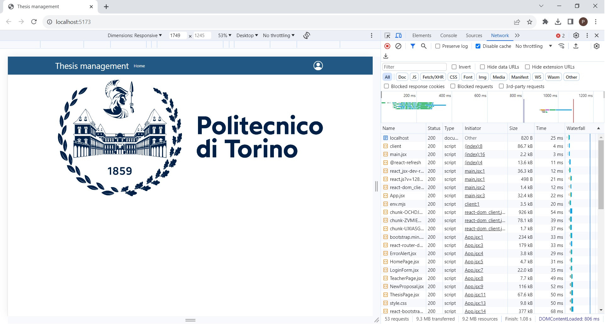
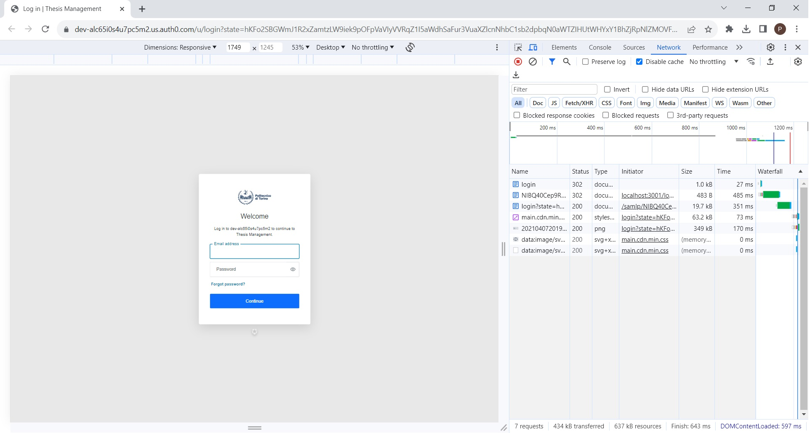
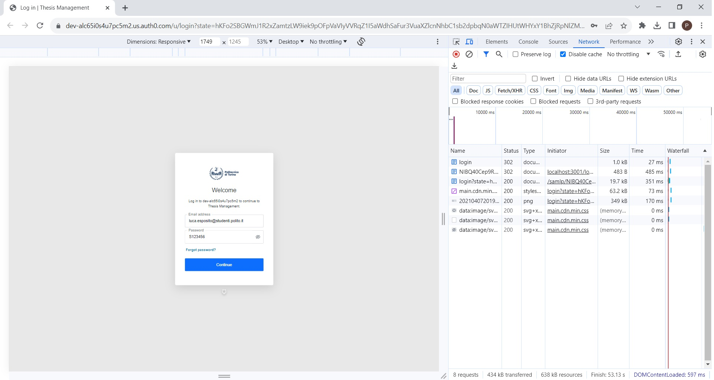
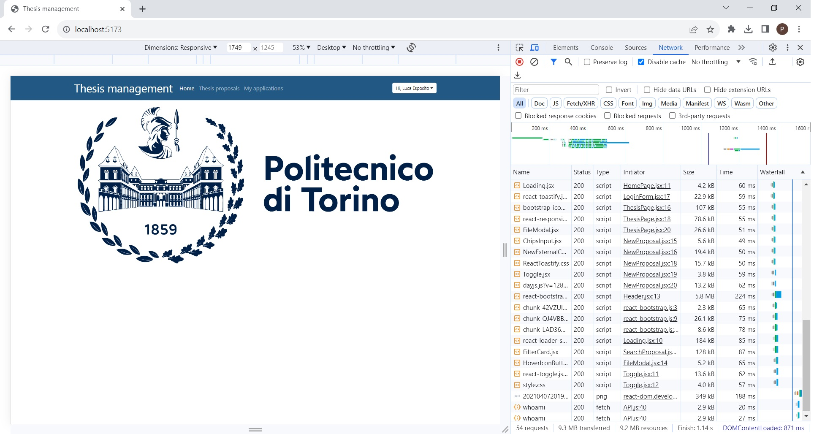
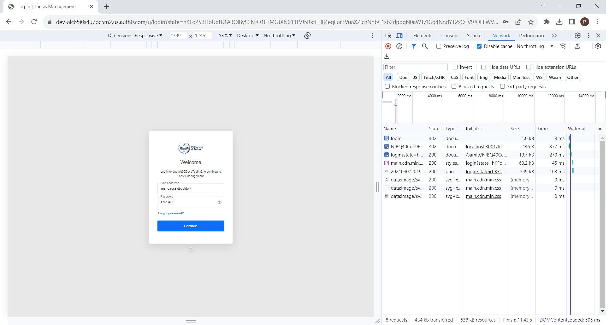

# e2e testing

## Contents

- [Homepage and login](#homepage-and-login)
- [US01 - Insert Proposal](#us01---insert-proposal)
- [US02 - Search Proposals](#us02---search-proposals)
- [US03 - Apply for Proposal](#us03---apply-for-proposal)
- [US04 - Browse Applications](#us04---browse-applications)
- [US05 - Accept Application](#us05---accept-application)
- [US06 - Browse Applications Decisions](#us06---browse-applications-decisions)

## Homepage and login

## US01 - Insert Proposal

## US02 - Search Proposals

## US03 - Apply for Proposal

## US04 - Browse Applications

## US05 - Accept Application

## US06 - Browse Applications Decisions